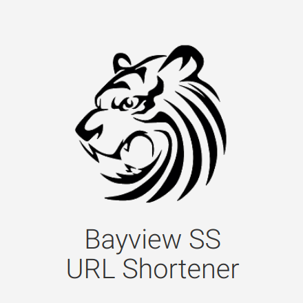

# BSSURL

#### Note: Do not use this, unless you have an alternative to JSONStore, which is down.
This is a custom URL shortener implemented using only HTML/CSS/JS. It uses the basic concept from https://github.com/bauripalash/simpleurlshortener, with more advanced features. It can be hosted on any static webpage hosting service, including the free GitHub/GitLab pages. It will just work out of the box, with a simple 3-step configuration:

## Configuration
 1. Go to https://www.jsonstore.io/ and copy the endpoint url.
 2. Go to the first line of `/assets/main.js` and replace <endpoint-url-here> with the endpoint url.
 3. Customize `index.html` and `/assets/styles.css` if you want, and you're good to go!

Please feel free to use any part of this repository in anything you want, as long as you keep it open-source!
